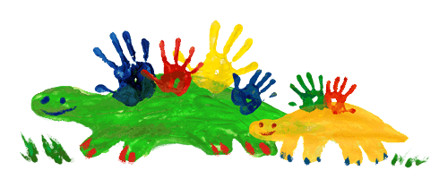

# Name:

> Add your name in the heading above.

## 1. Programming Experience

> What are the main programming languages (if any) that you currently use and what is your approximate level of mastery? Don't worry if you don't have much programming experience yet! This just helps me understand everyone's background and plan accordingly.

- Language1 (beginner/intermediate/advanced/expert)

- Language2 (beginner/intermediate/advanced/expert)

> Levels: beginner = know my way around the language enough to write some basic code; intermediate = know a few tricks and can usually figure out how to solve a problem using language help/online resources; advanced = can write code fluently without needing to stop for help and am generally aware of the language's best practices; expert = understand how the language is structured at a fundamental level and have a very intuitive understanding for efficiently solving any problem I encounter

## 2. Course Goals

> List three goals you would like to accomplish through this class. This can be anything from things you'd like to know, skills you'd like to learn or improve, concepts you'd like to understand or apply, etc.

1.  
2.  
3. 

## 3. Something fun

> Add a picture of yourself doing something you enjoy outside school (hiking, cooking, playing music, reading, etc) to the images folder and link to it here with a descriptive title (for mouseover). Make sure that images are not too big and in **jpeg/jpg** or **png** format. A width of 600 to maximally 1200 pixels is typically plenty large (i.e. less than **~2Mb**). You can scale your image to these dimensions using any photo editing software. For example, a convenient free online tool for scaling images is available at http://www.simpleimageresizer.com/

## 4. ???

> Include something of your own choosing not described above. Anything. Be creative!
